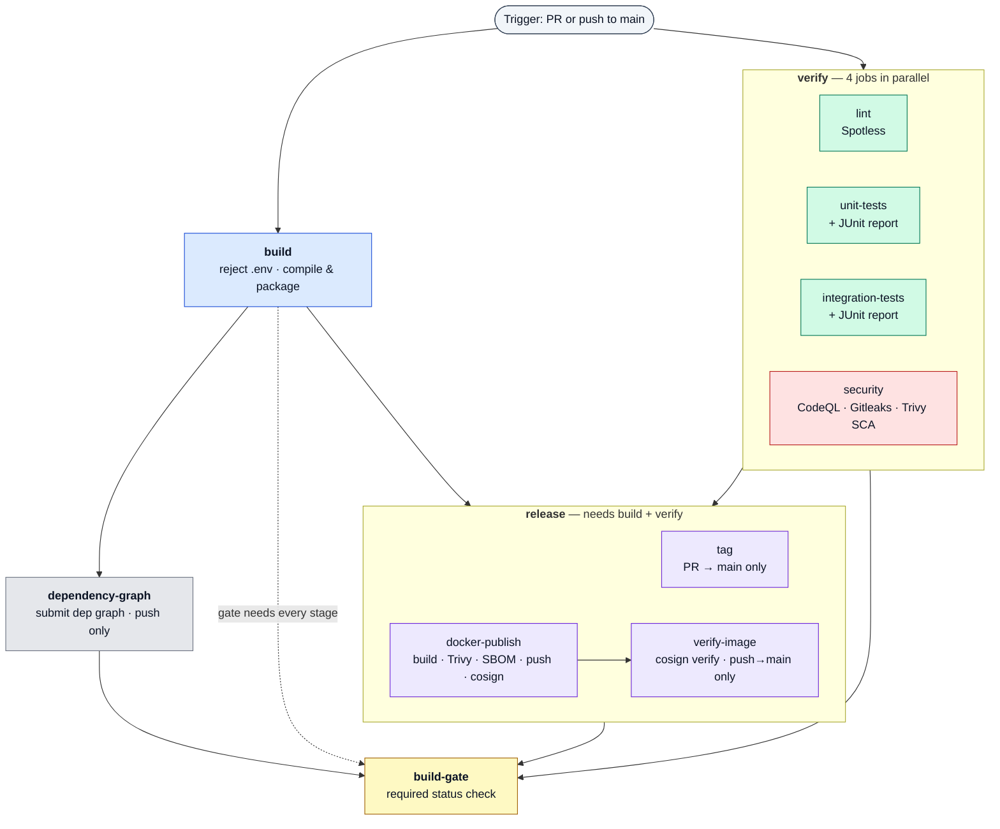

# java-cicd-template

Centralized CI/CD for Java / Spring Boot (Maven) services.

This repository is a **reusable GitHub Actions template**. Every pipeline stage is a
self-contained [reusable workflow](https://docs.github.com/en/actions/using-workflows/reusing-workflows)
(`on: workflow_call`), and they are all orchestrated by one master workflow. A consumer
repo makes a single call and gets build, lint, unit + integration tests, multi-layer
security scanning (SAST + secrets + dependency + image), SBOM generation, and **signed**
container publishing — on hardened, egress-controlled runners.

---

## Use it in your Spring Boot repo

Add **one** thin workflow to the downstream Java repo. It delegates everything to the
master pipeline:

```yaml
# .github/workflows/ci.yml  (in your Spring Boot repo)
name: CI/CD

on:
  push:
    branches: [main]
  pull_request:
    branches: [main]

# A reusable workflow can only use permissions the *caller* grants. Set these at the
# top level so the pipeline can tag, push to GHCR, upload CodeQL results, and — most
# importantly — mint an OIDC token for keyless image signing (id-token).
permissions:
  contents: write        # PR build tags + dependency graph submission
  packages: write        # push image to GHCR
  security-events: write # CodeQL SARIF upload
  id-token: write        # cosign keyless signing (REQUIRED — defaults to none)
  actions: read
  checks: write

jobs:
  pipeline:
    uses: pse-wtag/java-ci-cd-template/.github/workflows/master-maven-pipeline.yml@main
    # Forward secrets explicitly. `secrets: inherit` would hand this pipeline your
    # entire secret store, so any secret the template reads in future — including
    # one added by a compromised update — would be readable from your repo.
    secrets:
      CR_PAT: ${{ secrets.CR_PAT }}
    with:
      java-version: "25"
```

That's the whole integration. Everything below is driven from that one call.

> **Do not add a `concurrency:` block to your caller.** The master pipeline already
> groups by `${{ github.workflow }}-${{ github.ref }}` (PR runs cancel superseded runs;
> `main` runs always finish). If you must add one, give it a *different* group — otherwise
> the caller and the reusable workflow share a group and cancel each other.

> **`id-token: write` is not optional if you want signed images.** Unlike the other
> permissions it defaults to `none` even when the repo token is "read and write", so it
> must be granted explicitly. Without it, `docker-publish` still builds and pushes, but
> the cosign signing step fails.

### Consumer setup checklist

1. **Grant the permissions above** (especially `id-token: write`).
2. **Enable Code Scanning** (Settings → Security → Code scanning) so CodeQL runs — the
   stage self-skips cleanly when it's disabled.
3. **Add a Maven Dependabot config** to your repo (this template ships only the
   `github-actions` half). Drop this into `.github/dependabot.yml`:

   ```yaml
   version: 2
   updates:
     - package-ecosystem: maven
       directory: "/"
       schedule:
         interval: weekly
       open-pull-requests-limit: 10
     - package-ecosystem: github-actions
       directory: "/"
       schedule:
         interval: weekly
   ```

4. **Verify signatures on deploy** (or in an admission controller) with cosign:

   ```bash
   cosign verify ghcr.io/<org>/<repo>@<digest> \
     --certificate-identity-regexp "https://github.com/<org>/<repo>/.github/workflows/.+" \
     --certificate-oidc-issuer https://token.actions.githubusercontent.com
   ```

> Forking into another org? Update the `uses:` path in the caller **and** the
> `pse-wtag/java-ci-cd-template/...@c8a996c309864d873d441c0fd74c2b69f1ee5fdc` composite-action references inside the reusable
> workflows to point at your fork.

---

## Pipeline flow

The master pipeline runs **two waves plus a release stage and a final gate**. Each stage
is a reusable workflow that **fans its jobs out in parallel** internally:

1. **`build`** and **`verify`** start **together**, at the trigger — `verify` does not
   wait on `build`, so the four verify jobs (lint, unit-tests, integration-tests,
   security) and the packaging build all run at once. This is the main reason a run
   finishes in roughly the time of its slowest job rather than the sum of two waves.
2. **`dependency-graph`** runs after `build`, on `push` only. It is split out of `build`
   so the job that compiles PR-authored code keeps a read-only token while graph
   submission (which needs `contents: write`) never runs on a PR.
3. **`release`** does `needs: [build, verify]`, so it waits for the packaging build *and*
   all four verify jobs. Inside it, `tag` and `docker-publish` run **in parallel**; on a
   push to `main`, **`verify-image`** then re-checks the pushed image's cosign signature
   before the stage is allowed to succeed.
4. **`build-gate`** waits on all of the above and is the single required status check.



> **The whole of verify gates release.** `release` does `needs: [build, verify]`, so
> *both* `tag` and `docker-publish` wait for **all four** verify jobs (lint included) to
> finish. `build-gate` does `needs: [build, dependency-graph, verify, release]` and fails
> the run if any of them failed or was cancelled. `skipped` is **not** a failure —
> `dependency-graph` is push-only and the release jobs skip by event.

### Flow by event

- **Pull request → `main`:** `{ build · lint · unit · integration · security } →
  { tag · docker-build (no push) } → build-gate`. `dependency-graph` is skipped, and no
  image is pushed or signed.
- **Push → `main`:** `{ build · lint · unit · integration · security } →
  { dependency-graph · docker-publish (image → GHCR, scanned + signed) → verify-image
  (cosign verify) } → build-gate`. `tag` is skipped (PR-only).

### Releases are a separate workflow

**`auto-release.yml` is *not* a stage of the master pipeline.** It is a standalone
`on: push` → `main` workflow living in this repo, with its own concurrency group, that
bumps a SemVer patch tag, cuts a GitHub Release and prunes to the latest 10.

Two consequences worth knowing:

- Because it triggers on the push rather than on `release` succeeding, **a failing
  pipeline does not stop it** — a release can be cut for a commit whose build or scans
  failed.
- Because it is a plain `on: push` workflow rather than something
  `master-maven-pipeline.yml` calls, **consumer repos do not get it** by calling the
  master pipeline. Copy `.github/workflows/auto-release.yml` into your repo if you want
  automatic releases there.

---

## The jobs

| Stage | Job | Workflow | Runs when | What it does |
|-------|-----|----------|-----------|--------------|
| build | **build** | `build.yml` | always | Rejects tracked `.env` files, then compiles & packages (`clean package -DskipTests -T 1C`). Read-only token. |
| build | **dependency-graph** | `dependency-graph.yml` | `push`, after `build` | Submits the Maven dependency graph to GitHub. Split out of `build` because it needs `contents: write`. |
| verify | **lint** | `lint.yml` | always | Verifies code formatting with Spotless (`spotless:check`). |
| verify | **unit-tests** | `unit-tests.yml` | always | Runs `mvn test` and publishes a JUnit report. |
| verify | **integration-tests** | `integration-tests.yml` | always | Optionally exposes curated `extra-secrets` (never `GITHUB_TOKEN`), runs `mvn verify -Dsurefire.skip=true`, publishes a JUnit report. |
| verify | **security** | `security.yml` | always | Three parallel scanners — **CodeQL** SAST (`java-kotlin`, `build-mode: manual`, self-skips when Code Scanning is off), **Gitleaks** secret scan, and **Trivy** dependency (SCA) scan that fails on *fixable* HIGH/CRITICAL CVEs plus a non-blocking full report. The Trivy vulnerability DB is cached across runs (`actions/cache`). |
| release | **tag** | `tag.yml` | same-repo PR → `main` | Tags the PR build (`pr-<n>-run-<run>`) and prunes old PR tags (keeps the latest 4). |
| release | **docker-publish** | `docker.yml` | `push`, or same-repo PR (pushes only on `push`) | Builds an OCI image via Spring Boot Buildpacks, resolves its **digest**, **Trivy-scans** it (fails on fixable HIGH/CRITICAL; vuln DB cached via `actions/cache`), emits a **CycloneDX SBOM** artifact, **signs** the pushed image and **attests the SBOM** with cosign (keyless/OIDC), then prunes old GHCR images (keeps the latest 3). |
| release | **verify-image** | `release.yml` | push → `main`, after `docker-publish` | Runs `cosign verify` against the exact **digest** `docker-publish` pushed and signed (not a mutable tag) — asserting a keyless signature whose certificate identity matches `signer-identity-regexp` and whose OIDC issuer is GitHub Actions. Fails the release stage if the signature is missing or untrusted. |
| gate | **build-gate** | inline | `always()` | Fails the run if any of `build` / `dependency-graph` / `verify` / `release` failed or was cancelled. The single required status check. |

Outside the pipeline, two workflows run on their own triggers:

| Job | Workflow | Runs when | What it does |
|-----|----------|-----------|--------------|
| **auto-tag** | `auto-release.yml` | `on: push` → `main` (this repo only) | Bumps a SemVer patch tag, creates a GitHub Release with generated notes, keeps the latest 10. Not gated on the pipeline — see [Releases are a separate workflow](#releases-are-a-separate-workflow). |
| **actionlint / zizmor** | `workflow-lint.yml` | `on: push` → `main`, `on: pull_request` | Lints this repo's own Actions YAML (see [Security posture](#security-posture)). |

---

## Configuration

All inputs pass through `master-maven-pipeline.yml`. The most useful ones:

| Input | Default | Purpose |
|-------|---------|---------|
| `java-version` | `"25"` | JDK version for every stage. |
| `cache-type` | `"maven"` | Dependency-manager cache key for `setup-java`. |
| `build-egress-policy` | `"block"` | Harden-Runner egress policy for build / verify (`block` = enforce allowlists, `audit` = log-only). |
| `release-egress-policy` | `"block"` | Separate Harden-Runner egress policy for the release phase (docker publish + image verify). Split out from build so the broader registry set that buildpacks reach can be tuned independently. |
| `*-allowed-endpoints` | see file | Per-stage egress allowlists (build / test / security / docker). |
| `extra-*-endpoints` | `""` | Append hosts without overriding the defaults (`extra-build-endpoints`, `extra-test-endpoints`, `extra-security-endpoints`, `extra-docker-endpoints`). |
| `signer-identity-regexp` | `""` | Certificate-identity regexp `verify-image` requires of the image's keyless cosign signature. Empty defaults to `^https://github.com/<owner>/` (any workflow under the repo owner). Set it to the specific signing-workflow path for a tighter trust boundary. |
| `test-args` | `""` | Extra args for integration tests (e.g. `-D` properties). |
| `spring-boot-args` | `""` | Extra args for the Spring Boot image build. |

> Egress hardening defaults to **`block`** — the allowlists are enforced. Watch the first
> run's harden-runner summary and append any denied host via the `extra-*-endpoints`
> inputs. Set `build-egress-policy: audit` to switch to log-only while you tune them.

### Secrets

The consumer forwards secrets **explicitly** (never `secrets: inherit`); the master
pipeline then passes on only what each stage needs:

- **`CR_PAT`** — GHCR push / cleanup token, forwarded explicitly to `docker-publish`
  (falls back to `github.token` when unset). Not broadcast to other stages.
- **`extra-secrets`** — optional curated JSON object (`{"NAME":"value",...}`) exposed as
  env vars to the integration tests only. Pass just what a test needs against a real
  external system; prefer Testcontainers so tests need no secrets at all. **Never** pass
  `toJSON(secrets)`.

---

## Repository layout

```
.github/
├── workflows/
│   ├── master-maven-pipeline.yml   # Orchestrator — the entry point consumers call
│   ├── build.yml                   # Reject .env, compile & package (+ dep graph, push only)
│   ├── workflow-lint.yml           # actionlint + zizmor over this repo's own YAML
│   ├── verify.yml                  # Fan-out wrapper: lint + tests + security
│   ├── lint.yml                    # Spotless formatting check
│   ├── unit-tests.yml              # Unit tests + JUnit report
│   ├── integration-tests.yml      # Integration tests + JUnit report
│   ├── security.yml                # CodeQL (SAST) + Gitleaks (secrets) + Trivy (SCA)
│   ├── release.yml                 # Fan-out wrapper: tag + docker-publish
│   ├── tag.yml                     # PR build tagging
│   ├── docker.yml                  # Buildpack image → Trivy → SBOM → GHCR → cosign
│   └── auto-release.yml            # SemVer tag + GitHub Release (pipeline stage, gated on release)
├── actions/
│   ├── java-setup/                 # Composite: Temurin JDK + Maven cache + MAVEN_OPTS
│   └── ghcr-cleanup/               # Composite: GHCR image retention (with retry)
├── dependabot.yml                  # Weekly github-actions pin bumps
└── CODEOWNERS                      # Default reviewers for every PR

.githook/
├── pre-commit                      # Local gitleaks secret scan on staged changes
└── pre-push                        # actionlint + yamllint when YAML changes are pushed
```

### Composite actions

- **`java-setup`** — installs the Temurin JDK (default **25**), enables Maven dependency
  caching, and injects tuned `MAVEN_OPTS` (G1GC, RAM %, string dedup, capped metaspace).
- **`ghcr-cleanup`** — applies a retention policy to GHCR images (keeps the latest 3) with
  a built-in 60s retry. The owning `account` type (`user` / `org`) is configurable.

### Local git hooks

Enable them once per clone — make the hooks executable, then point git at `.githook`:

```bash
chmod +x .githook/pre-commit .githook/pre-push
git config core.hooksPath .githook
```

- **`pre-commit`** — runs `gitleaks protect --staged` to block secrets before they commit.
- **`pre-push`** — when pushed commits touch `*.yml` / `*.yaml`, runs `actionlint` and
  `yamllint` so broken workflow definitions never reach GitHub.

All three tools degrade gracefully if missing (the hook warns and skips), but install them
for full protection:

```bash
# macOS / Linux (Homebrew)
brew install gitleaks actionlint yamllint

# Linux (native)
pip install yamllint
go install github.com/rhysd/actionlint/cmd/actionlint@latest
# gitleaks: grab a binary from https://github.com/gitleaks/gitleaks/releases

# Windows (Chocolatey)
choco install gitleaks actionlint
pip install yamllint   # not on Chocolatey
```

---

## Security posture

- **Hardened runners** — every job that executes real work runs `step-security/harden-runner`
  with a configurable egress policy and per-stage endpoint allowlists. Build/verify and
  release each carry their own policy (`build-egress-policy` / `release-egress-policy`), both
  defaulting to `block`. Every job also sets `disable-sudo: true`; containers stay enabled
  for the jobs that need a Docker daemon (buildpack image builds, Testcontainers).
- **Pinned actions** — third-party actions are pinned to full commit SHAs; Dependabot
  keeps them current weekly.
- **Self-linting workflows** — this repo's product *is* workflow YAML, so `workflow-lint.yml`
  runs `actionlint` and `zizmor` (Actions-specific SAST: template injection, excessive
  permissions, credential persistence) over `.github/**` on every PR, failing on medium+
  findings. The same checks run locally in `pre-push`, but hooks are skippable — CI is not.
- **Secret scanning** — Gitleaks in CI (`security.yml`) *and* locally (`pre-commit`).
- **Static analysis (SAST)** — CodeQL for `java-kotlin`.
- **Dependency scanning (SCA)** — Trivy flags known CVEs in declared/transitive deps;
  the build fails on fixable HIGH/CRITICAL (`ignore-unfixed` skips un-actionable ones).
  A second, non-blocking Trivy pass reports everything the gate drops — unfixed vulns,
  hardcoded secrets and IaC misconfigurations — so they stay visible rather than silent.
- **Image scanning** — the built OCI image is Trivy-scanned before it ships, on PRs too.
- **Cached vuln DB** — both Trivy scans cache the vulnerability database via `actions/cache`
  (keyed per day, with a shared restore fallback) to cut scan time and avoid rate limits.
- **Supply-chain provenance** — a CycloneDX **SBOM** per build, uploaded as an artifact
  **and attested to the pushed digest** with cosign (`cosign attest --type cyclonedx`), so
  the SBOM is cryptographically bound to the image (`cosign verify-attestation` downstream).
  Pushed images are also **signed with cosign** using keyless OIDC (no long-lived keys).
- **Signature verification (verify-then-trust)** — on push to `main`, `verify-image` runs
  `cosign verify` against the exact **digest** that was pushed and signed (not the mutable
  tag), asserting a signature whose certificate identity matches `signer-identity-regexp`
  and whose issuer is GitHub Actions. A missing or untrusted signature fails the release.
  Downstream deploys should re-run the same check at admission time (see the consumer
  checklist) rather than trusting the tag alone.
- **Scan-what-you-sign** — the pushed image's immutable digest is resolved once, right
  after the push, and that single reference drives the vulnerability scan, the SBOM,
  the signature and the attestation. Resolving by tag per-step would let the tag move
  in between, so what was scanned would not provably be what was signed.
- **Fail-closed SAST** — the CodeQL job distinguishes "code scanning is disabled for this
  repo" from "the availability probe failed". A rate limit, expired token or transient 5xx
  fails the job rather than silently skipping analysis while reporting success.
- **`.env` guard** — the build fails if tracked `.env` files are detected.
- **Least privilege** — permissions are scoped per job, not globally, and consumers forward
  secrets explicitly rather than with `secrets: inherit`. The job that compiles PR-authored
  code holds a read-only token; dependency-graph submission, which needs `contents: write`,
  runs in a separate push-only job.
