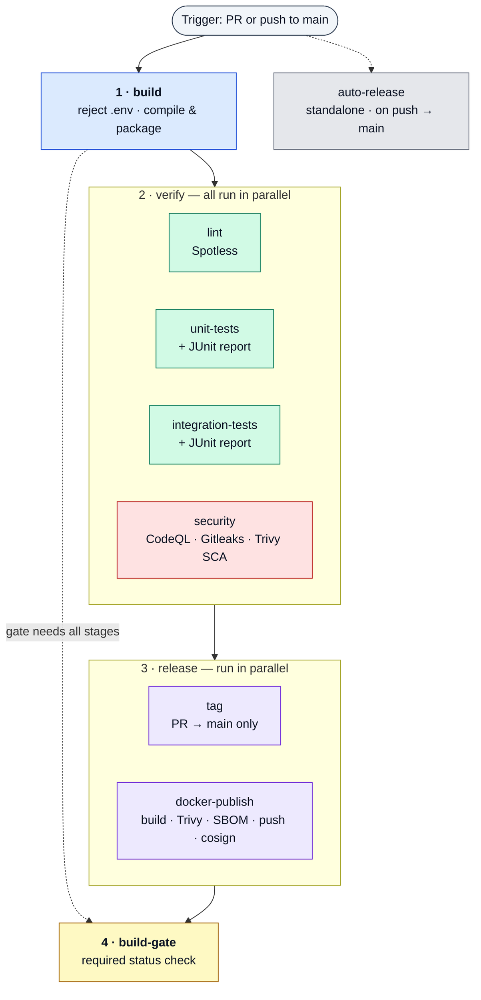

# java-cicd-template

Centralized CI/CD for Java / Spring Boot (Maven) services.

This repository is a **reusable GitHub Actions template**. Every pipeline stage is a
self-contained [reusable workflow](https://docs.github.com/en/actions/using-workflows/reusing-workflows)
(`on: workflow_call`), and they are all orchestrated by one master workflow. A consumer
repo makes a single call and gets build, lint, unit + integration tests, multi-layer
security scanning (SAST + secrets + dependency + image), SBOM generation, and **signed**
container publishing — on hardened, egress-controlled runners.

---

## Use it in your Spring Boot repo

Add **one** thin workflow to the downstream Java repo. It delegates everything to the
master pipeline:

```yaml
# .github/workflows/ci.yml  (in your Spring Boot repo)
name: CI/CD

on:
  push:
    branches: [main]
  pull_request:
    branches: [main]

# A reusable workflow can only use permissions the *caller* grants. Set these at the
# top level so the pipeline can tag, push to GHCR, upload CodeQL results, and — most
# importantly — mint an OIDC token for keyless image signing (id-token).
permissions:
  contents: write        # PR build tags
  packages: write        # push image to GHCR
  security-events: write # CodeQL SARIF upload
  id-token: write        # cosign keyless signing (REQUIRED — defaults to none)
  actions: read
  checks: write
  pull-requests: write

jobs:
  pipeline:
    uses: pse-wtag/java-cicd-template/.github/workflows/master-maven-pipeline.yml@main
    secrets: inherit
    with:
      java-version: "25"
```

That's the whole integration. Everything below is driven from that one call.

> **Do not add a `concurrency:` block to your caller.** The master pipeline already
> groups by `${{ github.workflow }}-${{ github.ref }}` (PR runs cancel superseded runs;
> `main` runs always finish). If you must add one, give it a *different* group — otherwise
> the caller and the reusable workflow share a group and cancel each other.

> **`id-token: write` is not optional if you want signed images.** Unlike the other
> permissions it defaults to `none` even when the repo token is "read and write", so it
> must be granted explicitly. Without it, `docker-publish` still builds and pushes, but
> the cosign signing step fails.

### Consumer setup checklist

1. **Grant the permissions above** (especially `id-token: write`).
2. **Enable Code Scanning** (Settings → Security → Code scanning) so CodeQL runs — the
   stage self-skips cleanly when it's disabled.
3. **Add a Maven Dependabot config** to your repo (this template ships only the
   `github-actions` half). Drop this into `.github/dependabot.yml`:

   ```yaml
   version: 2
   updates:
     - package-ecosystem: maven
       directory: "/"
       schedule:
         interval: weekly
       open-pull-requests-limit: 10
     - package-ecosystem: github-actions
       directory: "/"
       schedule:
         interval: weekly
   ```

4. **Verify signatures on deploy** (or in an admission controller) with cosign:

   ```bash
   cosign verify ghcr.io/<org>/<repo>@<digest> \
     --certificate-identity-regexp "https://github.com/<org>/<repo>/.github/workflows/.+" \
     --certificate-oidc-issuer https://token.actions.githubusercontent.com
   ```

> Forking into another org? Update the `uses:` path in the caller **and** the
> `pse-wtag/java-cicd-template/...@v0.0.3` composite-action references inside the reusable
> workflows to point at your fork.

---

## Pipeline flow

The master pipeline runs **three sequential stages** plus a final gate. Each stage is a
reusable workflow that **fans its jobs out in parallel** internally:

1. **`build`** runs first, alone.
2. When it passes, **`verify`** runs — its four jobs (lint, unit-tests,
   integration-tests, security) all start **at once**.
3. When *all* of verify passes, **`release`** runs — `tag` and `docker-publish` run
   **in parallel**.
4. **`build-gate`** waits on all three stages and is the single required status check.

`auto-release` is a **separate, standalone** workflow (`on: push` to `main`) — not part
of the master pipeline.



> **The whole of stage 2 gates stage 3.** `release` does `needs: verify`, so *both* `tag`
> and `docker-publish` wait for **all four** verify jobs (lint included) to finish.
> `build-gate` does `needs: [build, verify, release]` and fails the run if any of them
> failed or was cancelled.

### Flow by event

- **Pull request → `main`:** `build → { lint · unit · integration · security } →
  { tag · docker-build (no push) } → build-gate`. No image is pushed or signed.
- **Push → `main`:** `build → { lint · unit · integration · security } →
  docker-publish (image → GHCR, scanned + signed) → build-gate`. `tag` is skipped
  (PR-only), and `auto-release.yml` fires independently to cut a release.

---

## The jobs

| # | Job | Workflow | Runs when | What it does |
|---|-----|----------|-----------|--------------|
| 1 | **build** | `build.yml` | always | Rejects tracked `.env` files, compiles & packages (`clean package -DskipTests`), submits the dependency graph on `push`. |
| 2 | **lint** | `lint.yml` | always | Verifies code formatting with Spotless (`spotless:check`). |
| 2 | **unit-tests** | `unit-tests.yml` | always | Runs `mvn test` and publishes a JUnit report. |
| 2 | **integration-tests** | `integration-tests.yml` | always | Optionally exposes curated `extra-secrets` (never `GITHUB_TOKEN`), runs `mvn verify -Dsurefire.skip=true`, publishes a JUnit report. |
| 2 | **security** | `security.yml` | always | Three parallel scanners — **CodeQL** SAST (`java-kotlin`, self-skips when Code Scanning is off), **Gitleaks** secret scan, and **Trivy** dependency (SCA) scan that fails on *fixable* HIGH/CRITICAL CVEs. The Trivy vulnerability DB is cached across runs (`actions/cache`). |
| 3 | **tag** | `tag.yml` | PR → `main` | Tags the PR build (`pr-<n>-run-<run>`) and prunes old PR tags (keeps the latest 4). |
| 3 | **docker-publish** | `docker.yml` | `push`, or same-repo PR (pushes only on `push`) | Builds an OCI image via Spring Boot Buildpacks, **Trivy-scans** it (fails on fixable HIGH/CRITICAL; vuln DB cached via `actions/cache`), emits a **CycloneDX SBOM** artifact, pushes to **GHCR**, **signs** the pushed image with cosign (keyless/OIDC), then prunes old images (keeps the latest 3). |
| 4 | **build-gate** | inline | `always()` | Fails the run if any of `build` / `verify` / `release` failed or was cancelled. The single required status check. |
| — | **auto-release** | `auto-release.yml` | push → `main` | Standalone workflow: bumps a SemVer patch tag, creates a GitHub Release with notes, keeps the latest 10. |

---

## Configuration

All inputs pass through `master-maven-pipeline.yml`. The most useful ones:

| Input | Default | Purpose |
|-------|---------|---------|
| `java-version` | `"25"` | JDK version for every stage. |
| `cache-type` | `"maven"` | Dependency-manager cache key for `setup-java`. |
| `build-egress-policy` | `"block"` | Harden-Runner egress policy for build / verify / release (`block` = enforce allowlists, `audit` = log-only). |
| `*-allowed-endpoints` | see file | Per-stage egress allowlists (build / test / security / docker). |
| `extra-*-endpoints` | `""` | Append hosts without overriding the defaults (`extra-build-endpoints`, `extra-test-endpoints`, `extra-security-endpoints`, `extra-docker-endpoints`). |
| `test-args` | `""` | Extra args for integration tests (e.g. `-D` properties). |
| `spring-boot-args` | `""` | Extra args for the Spring Boot image build. |

> Egress hardening defaults to **`block`** — the allowlists are enforced. Watch the first
> run's harden-runner summary and append any denied host via the `extra-*-endpoints`
> inputs. Set `build-egress-policy: audit` to switch to log-only while you tune them.

### Secrets

The consumer passes secrets with `secrets: inherit`; the master pipeline forwards only
what each stage needs:

- **`CR_PAT`** — GHCR push / cleanup token, forwarded explicitly to `docker-publish`
  (falls back to `github.token` when unset). Not broadcast to other stages.
- **`extra-secrets`** — optional curated JSON object (`{"NAME":"value",...}`) exposed as
  env vars to the integration tests only. Pass just what a test needs against a real
  external system; prefer Testcontainers so tests need no secrets at all. **Never** pass
  `toJSON(secrets)`.

---

## Repository layout

```
.github/
├── workflows/
│   ├── master-maven-pipeline.yml   # Orchestrator — the entry point consumers call
│   ├── build.yml                   # Reject .env, compile & package, submit dep graph
│   ├── verify.yml                  # Fan-out wrapper: lint + tests + security
│   ├── lint.yml                    # Spotless formatting check
│   ├── unit-tests.yml              # Unit tests + JUnit report
│   ├── integration-tests.yml      # Integration tests + JUnit report
│   ├── security.yml                # CodeQL (SAST) + Gitleaks (secrets) + Trivy (SCA)
│   ├── release.yml                 # Fan-out wrapper: tag + docker-publish
│   ├── tag.yml                     # PR build tagging
│   ├── docker.yml                  # Buildpack image → Trivy → SBOM → GHCR → cosign
│   └── auto-release.yml            # SemVer tag + GitHub Release (standalone, push to main)
├── actions/
│   ├── java-setup/                 # Composite: Temurin JDK + Maven cache + MAVEN_OPTS
│   └── ghcr-cleanup/               # Composite: GHCR image retention (with retry)
├── dependabot.yml                  # Weekly github-actions pin bumps
└── CODEOWNERS                      # Default reviewers for every PR

.githook/
├── pre-commit                      # Local gitleaks secret scan on staged changes
└── pre-push                        # actionlint + yamllint when YAML changes are pushed
```

### Composite actions

- **`java-setup`** — installs the Temurin JDK (default **25**), enables Maven dependency
  caching, and injects tuned `MAVEN_OPTS` (G1GC, RAM %, string dedup, capped metaspace).
- **`ghcr-cleanup`** — applies a retention policy to GHCR images (keeps the latest 3) with
  a built-in 60s retry. The owning `account` type (`user` / `org`) is configurable.

### Local git hooks

Enable them once per clone — make the hooks executable, then point git at `.githook`:

```bash
chmod +x .githook/pre-commit .githook/pre-push
git config core.hooksPath .githook
```

- **`pre-commit`** — runs `gitleaks protect --staged` to block secrets before they commit.
- **`pre-push`** — when pushed commits touch `*.yml` / `*.yaml`, runs `actionlint` and
  `yamllint` so broken workflow definitions never reach GitHub.

All three tools degrade gracefully if missing (the hook warns and skips), but install them
for full protection:

```bash
# macOS / Linux (Homebrew)
brew install gitleaks actionlint yamllint

# Linux (native)
pip install yamllint
go install github.com/rhysd/actionlint/cmd/actionlint@latest
# gitleaks: grab a binary from https://github.com/gitleaks/gitleaks/releases

# Windows (Chocolatey)
choco install gitleaks actionlint
pip install yamllint   # not on Chocolatey
```

---

## Security posture

- **Hardened runners** — every job runs `step-security/harden-runner` with a configurable
  egress policy and per-stage endpoint allowlists.
- **Pinned actions** — third-party actions are pinned to full commit SHAs; Dependabot
  keeps them current weekly.
- **Secret scanning** — Gitleaks in CI (`security.yml`) *and* locally (`pre-commit`).
- **Static analysis (SAST)** — CodeQL for `java-kotlin`.
- **Dependency scanning (SCA)** — Trivy flags known CVEs in declared/transitive deps;
  the build fails on fixable HIGH/CRITICAL (`ignore-unfixed` skips un-actionable ones).
- **Image scanning** — the built OCI image is Trivy-scanned before it ships, on PRs too.
- **Cached vuln DB** — both Trivy scans cache the vulnerability database via `actions/cache`
  (keyed per day, with a shared restore fallback) to cut scan time and avoid rate limits.
- **Supply-chain provenance** — a CycloneDX **SBOM** per build, and pushed images are
  **signed with cosign** using keyless OIDC (no long-lived keys).
- **`.env` guard** — the build fails if tracked `.env` files are detected.
- **Least privilege** — permissions are scoped per job, not globally; `docker-publish`
  receives only `CR_PAT`, not the whole secret store.
