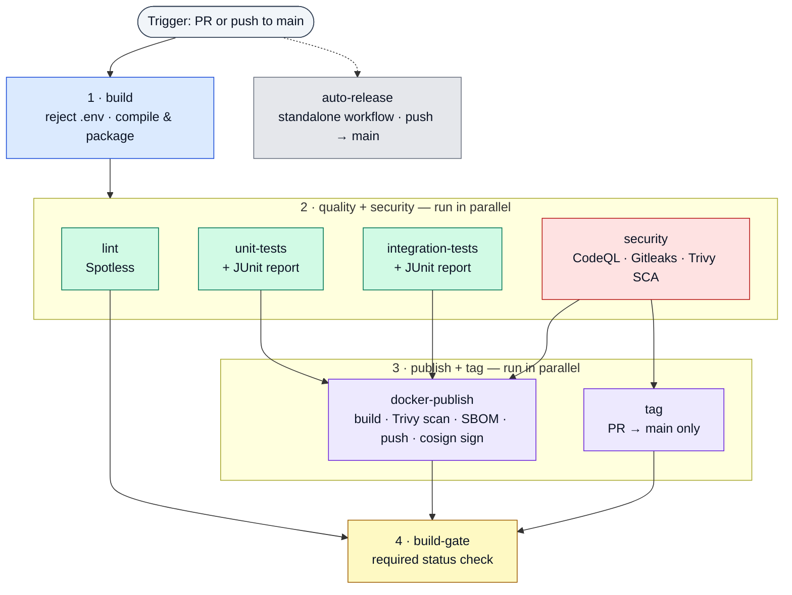

# java-cicd-template

Centralized CI/CD for Java / Spring Boot (Maven) services.

This repository is a **reusable GitHub Actions template**. Each pipeline stage is a
self-contained [reusable workflow](https://docs.github.com/en/actions/using-workflows/reusing-workflows)
(`on: workflow_call`), and they are all orchestrated by a single master workflow.
Consumer repositories call the master pipeline and get build, lint, test, multi-layer
security scanning (SAST + secrets + dependency + image), SBOM generation, and **signed**
container publishing out of the box — on hardened, egress-controlled runners.

## How consumers use it

A downstream Java repo adds a thin workflow that delegates to the master pipeline:

```yaml
# .github/workflows/ci.yml (in the consumer repo)
name: CI/CD
on:
  push:
    branches: [main]
  pull_request:
    branches: [main]

# Concurrency is handled *inside* the master pipeline (grouped by this caller's
# workflow + ref: PR runs cancel superseded runs, main runs always finish). You do
# not need to add a concurrency block here — and if you do, give it a *different*
# group than `${{ github.workflow }}-${{ github.ref }}`, or the caller and the
# reusable workflow share one group and can cancel each other.

# A reusable workflow can only use permissions the *caller* grants. Set these
# at the top level so the pipeline can tag, push to GHCR, upload CodeQL results,
# and — critically — mint an OIDC token for keyless image signing (id-token).
permissions:
  contents: write        # PR build tags
  packages: write        # push image to GHCR
  security-events: write # CodeQL SARIF upload
  id-token: write        # cosign keyless signing (REQUIRED — defaults to none)
  actions: read
  checks: write
  pull-requests: write

jobs:
  pipeline:
    uses: pse-wtag/java-cicd-template/.github/workflows/master-maven-pipeline.yml@main
    secrets: inherit
    with:
      java-version: "25"
```

Everything below is driven from that one call.

> **`id-token: write` is not optional if you want signed images.** Unlike the other
> permissions, it defaults to `none` even when your repo's workflow token is set to
> "read and write", so it must be granted explicitly in the caller. Without it, the
> `docker-publish` stage still builds and pushes, but the cosign signing step fails.

### Consumer setup checklist

- **Grant the permissions above** in your caller workflow (especially `id-token: write`).
- **Enable Code Scanning** (Settings → Security → Code scanning) so the CodeQL stage runs
  — it self-skips when disabled.
- **Add a Maven Dependabot config** to *your* repo (this template repo has no `pom.xml`, so
  it can only ship the `github-actions` half). Drop this into `.github/dependabot.yml`:

  ```yaml
  version: 2
  updates:
    - package-ecosystem: maven
      directory: "/"
      schedule:
        interval: weekly
      open-pull-requests-limit: 10
    - package-ecosystem: github-actions
      directory: "/"
      schedule:
        interval: weekly
  ```

- **Verify signatures** on deploy (or in an admission controller) with cosign:

  ```bash
  cosign verify ghcr.io/<org>/<repo>@<digest> \
    --certificate-identity-regexp "https://github.com/<org>/<repo>/.github/workflows/.+" \
    --certificate-oidc-issuer https://token.actions.githubusercontent.com
  ```

## Pipeline structure

`build` runs first. Once it passes, **all four stage-2 jobs — lint, unit-tests,
integration-tests, and security — fan out in parallel**. `docker-publish` waits on the
tests and security (not lint); `tag` waits on security. `build-gate` collects everything.
Each stage has its own color; the dashed boxes group jobs that run concurrently.



> **`security` is a stage-2 job** — it depends only on `build` and runs alongside the
> tests, not after them. `build-gate` explicitly `needs` **every** job (build, lint,
> unit-tests, integration-tests, security, tag, docker-publish); the diagram draws only
> the leaf edges for readability. `auto-release` is a **separate top-level workflow**
> (`on: push`), not called by the master pipeline.

### Stage-by-stage

| # | Stage | Workflow | `needs` | Runs when | What it does |
|---|-------|----------|---------|-----------|--------------|
| 1 | **Build** | `build.yml` | — | always | Rejects tracked `.env` files, compiles & packages (`clean package -DskipTests`), submits the dependency graph on `push`. |
| 2 | **Lint** | `lint.yml` | `build` | always | Verifies code formatting via Spotless. |
| 2 | **Unit Tests** | `unit-tests.yml` | `build` | always | Runs unit tests (`mvn test`) and publishes a JUnit report. |
| 2 | **Integration Tests** | `integration-tests.yml` | `build` | always | Optionally exposes curated `extra-secrets` (never `GITHUB_TOKEN`), runs `mvn verify -Dsurefire.skip=true`, publishes a JUnit report. |
| 2 | **Security** | `security.yml` | `build` | always | Three parallel scanners: **CodeQL** SAST (`java-kotlin`, self-skips when Code Scanning is disabled), **Gitleaks** secret scan, and **Trivy** dependency (SCA) scan — fails on fixable HIGH/CRITICAL CVEs. |
| 3 | **Tag** | `tag.yml` | `security` | PR → `main` | Tags the PR build (`pr-<n>-run-<run>`) and prunes old PR tags (keeps latest 4). |
| 3 | **Docker Publish** | `docker.yml` | `unit-tests`, `integration-tests`, `security` | `push`, or same-repo PR (publishes only on `push`) | Builds an OCI image via Spring Boot Buildpacks, **scans it with Trivy** (fails on fixable HIGH/CRITICAL), emits a **CycloneDX SBOM** artifact, pushes to **GHCR**, **signs the pushed image with cosign** (keyless/OIDC), then prunes old images (keeps latest 3). |
| 4 | **Build Gate** | inline job | all of the above | `always()` | Fails the run if any upstream job failed or was cancelled — the single required status check. |
| — | **Auto-Release** | `auto-release.yml` | *(standalone)* | push → `main` | Separate workflow: bumps a SemVer patch tag, creates a GitHub Release with notes, keeps the latest 10. |

### Flow by event

- **Pull request → `main`:** `build → { lint · unit · integration · security } → { tag · docker-build (no publish) } → build-gate`. No image is pushed or signed.
- **Push → `main`:** `build → { lint · unit · integration · security } → docker-publish (image → GHCR, scanned + signed) → build-gate`. `auto-release.yml` fires independently to cut a release. (`tag` is skipped — it's PR-only.)

## Repository layout

```
.github/
├── workflows/
│   ├── master-maven-pipeline.yml   # Orchestrator — the entry point consumers call
│   ├── build.yml                   # Reject .env, compile & package, submit dep graph
│   ├── lint.yml                    # Spotless formatting check
│   ├── unit-tests.yml              # Unit tests + JUnit report
│   ├── integration-tests.yml      # Integration tests + JUnit report
│   ├── security.yml                # CodeQL (SAST) + Gitleaks (secrets) + Trivy (SCA)
│   ├── tag.yml                     # PR build tagging
│   ├── docker.yml                  # Buildpack image → Trivy scan → SBOM → GHCR → cosign sign
│   └── auto-release.yml            # SemVer tag + GitHub Release (standalone, on push to main)
├── actions/
│   ├── java-setup/                 # Composite: Temurin JDK + Maven cache + MAVEN_OPTS
│   └── ghcr-cleanup/               # Composite: retention policy for GHCR images (with retry)
├── dependabot.yml                  # Weekly github-actions pin bumps (add a maven entry in consumers)
└── CODEOWNERS                      # Default reviewers for every PR

.githook/
├── pre-commit                      # Local gitleaks secret scan on staged changes
└── pre-push                        # actionlint + yamllint when YAML changes are pushed
```

## Reusable building blocks

### Composite actions

- **`java-setup`** — installs the Temurin JDK (default **25**), enables Maven dependency
  caching, and injects tuned `MAVEN_OPTS` (G1GC, RAM %, string dedup, capped metaspace).
- **`ghcr-cleanup`** — applies a retention policy to GHCR images (keeps the latest 3) with a
  built-in 60s retry. The owning `account` type (`user` / `org`) is configurable.

### Local git hooks

Enable them once per clone — make the hooks executable, then point git at the
`.githook` directory:

```bash
chmod +x .githook/pre-commit
chmod +x .githook/pre-push
git config core.hooksPath .githook
```

- **`pre-commit`** — runs `gitleaks protect --staged` to block secrets before they are committed.
- **`pre-push`** — when pushed commits touch `*.yml` / `*.yaml`, runs `actionlint` and
  `yamllint` so broken workflow definitions never reach GitHub.

All three tools degrade gracefully if not installed (the hook prints a warning and skips
that check), but install them to get the full protection:

**macOS (Homebrew)**

```bash
brew install gitleaks actionlint yamllint
```

**Linux**

```bash
# Homebrew on Linux works the same as macOS:
brew install gitleaks actionlint yamllint

# …or via native tooling:
pip install yamllint                                              # yamllint
go install github.com/rhysd/actionlint/cmd/actionlint@latest     # actionlint
# gitleaks: grab a binary from https://github.com/gitleaks/gitleaks/releases
```

**Windows (Chocolatey)**

```powershell
choco install gitleaks actionlint
pip install yamllint            # yamllint is not on Chocolatey; install via pip
```

## Configuration

All inputs are passed through `master-maven-pipeline.yml`. The most useful ones:

| Input | Default | Purpose |
|-------|---------|---------|
| `java-version` | `"25"` | JDK version for every stage. |
| `cache-type` | `"maven"` | Dependency-manager cache key for `setup-java` (Maven only). |
| `build-egress-policy` | `"audit"` | Harden-Runner egress policy (`audit` = log-only, `block` = enforce allowlists). |
| `*-allowed-endpoints` | see file | Per-stage allowlists for build / test / security / docker egress. |
| `extra-*-endpoints` | `""` | Append endpoints without overriding the defaults (`extra-build-endpoints`, `extra-test-endpoints`, `extra-security-endpoints`, `extra-docker-endpoints`). |
| `test-args` | `""` | Extra args for integration tests (e.g. `-D` properties). |
| `spring-boot-args` | `""` | Extra args for the Spring Boot image build. |

> Egress hardening defaults to **`audit`** (log-only). Set `build-egress-policy: block` to
> enforce the allowlists — and extend them via the `extra-*-endpoints` inputs if your build
> needs additional hosts.

### Secrets used

The consumer passes secrets with `secrets: inherit`; the master pipeline then forwards
only what each stage needs:

- `CR_PAT` — GHCR push / cleanup token, forwarded explicitly to `docker-publish` (falls
  back to `github.token` when unset). It is **not** broadcast to other stages.
- `extra-secrets` — optional curated JSON object (`{"NAME":"value",...}`) exposed as env
  vars to the integration tests only. Pass just what a test needs against a real external
  system; prefer Testcontainers so tests need no secrets at all. Never pass `toJSON(secrets)`.

## Security posture

- **Hardened runners** — every job runs `step-security/harden-runner` with configurable
  egress policy and per-stage endpoint allowlists.
- **Pinned actions** — third-party actions are pinned to full commit SHAs; Dependabot keeps
  them current weekly.
- **Secret scanning** — Gitleaks in CI (`security.yml`) *and* locally (`pre-commit`).
- **Static analysis (SAST)** — CodeQL for `java-kotlin`.
- **Dependency scanning (SCA)** — Trivy flags known CVEs in declared/transitive dependencies;
  the build fails on fixable HIGH/CRITICAL findings (`ignore-unfixed` skips un-actionable ones).
- **Image scanning** — the published OCI image is Trivy-scanned before it ships, on PRs too.
- **Supply-chain provenance** — a CycloneDX **SBOM** is generated per build, and pushed images
  are **signed with cosign** using keyless OIDC (no long-lived keys).
- **`.env` guard** — the build fails if tracked `.env` files are detected.
- **Least privilege** — permissions are scoped per job, not globally; `docker-publish` receives
  only `CR_PAT` rather than the whole secret store.

> **Note:** the reusable workflows reference this repo's own composite actions via
> `pse-wtag/java-cicd-template/.github/actions/...@main` (the self-reference form required for
> reusable workflows). When forking into another org, update those references — and the
> `uses:` path in the consumer example — to point at your fork.
